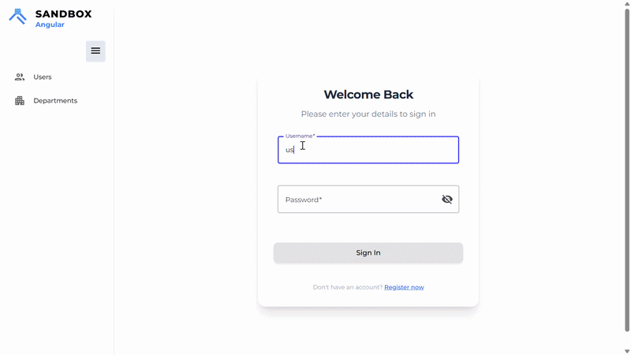

# Angular SPA

A modern Single Page Application (SPA) built with **Angular 19.1.1**, featuring a rich user interface with charts, mapping capabilities.



> **Note**: The backend API for this application is developed and maintained by another team member.

## Quick Start

### Prerequisites
- Node.js (latest LTS recommended)
- npm or yarn package manager

### Installation

1. **Install dependencies**
   ```bash
   npm install
   ```

2. **Start development server**
   ```bash
   npm start
   ```
   
   The application will be available at `http://localhost:4201`

### Build for Production

```bash
npm run build
```

The build artifacts will be stored in the `dist/` directory.

## Technology Stack

### Core Framework
- **Angular**: 19.1.1
- **TypeScript**: 5.6.3
- **RxJS**: 7.8.1

### Styling & UI
- **Tailwind CSS**: 3.4.17 (Utility-first CSS framework)
- **SCSS**: Component-scoped styles
- **Angular Material**: 19.1.1 (Pre-built UI components)

### Charts & Visualization
- **ApexCharts**: Modern charting library
- **Chart.js**: Simple yet flexible charting
- **ng2-charts**: Angular wrapper for Chart.js
- **OpenLayers**: 10.2.1 (Mapping library)

### Forms & Input
- **Reactive Forms**: Advanced form handling
- **ngx-quill**: WYSIWYG rich text editor
- **ng-select**: Advanced select component
- **ngx-material-timepicker**: Time picking component

### Utilities
- **@ngneat/transloco**: Internationalization
- **@ngx-translate/core**: Translation management
- **ngx-moment**: Moment.js integration
- **Luxon**: Modern date/time library
- **lodash-es**: Utility functions
- **crypto-js**: Cryptographic library

### File Handling
- **ng2-file-upload**: File upload component

### UI/UX
- **ngx-skeleton-loader**: Skeleton loading states
- **flag-icons**: Country flag icons
- **ngx-flag-icon-css**: Flag icon CSS

### Testing
- **Jasmine**: Unit testing framework
- **Karma**: Test runner
- **Cypress**: End-to-end testing

### Development Tools
- **ESLint**: Code linting
- **Prettier**: Code formatting
- **YASAG**: API code generator

## Available Scripts

| Command | Description |
|---------|-------------|
| `npm start` | Run development server on port 4201 |
| `npm run build` | Build for production |
| `npm run watch` | Build in watch mode (development) |
| `npm test` | Run unit tests via Karma |
| `npm run lint` | Lint TypeScript and template code |
| `npm run lint:fix` | Fix linting issues automatically |
| `npm run prettier` | Format code with Prettier |
| `npm run apigen` | Generate API client from Swagger |
| `ng serve` | Angular CLI serve command |

## Testing

### Unit Tests
```bash
npm test
```

Runs tests using Jasmine and Karma in watch mode.

### E2E Tests
```bash
npx cypress open
```

Open Cypress Test Runner for end-to-end testing.

## Project Structure

```
src/
├── app/               # Angular application
│   ├── components/    # Reusable components
│   ├── pages/         # Page components
│   ├── services/      # API and business logic services
│   ├── models/        # TypeScript interfaces and models
│   ├── interceptors/  # HTTP interceptors
│   ├── guards/        # Route guards
│   ├── pipes/         # Custom pipes
│   └── app.module.ts  # Main app module
├── assets/            # Static assets (images, icons)
├── styles/            # Global styles
├── environments/      # Environment configurations
└── main.ts            # Application entry point
```

## Configuration Files

- **angular.json**: Angular CLI configuration
- **tsconfig.json**: TypeScript configuration
- **tailwind.config.js**: Tailwind CSS configuration
- **karma.conf.js**: Karma test runner configuration
- **cypress.config.js**: Cypress E2E test configuration
- **transloco.config.js**: Internationalization configuration
- **proxy.conf.json**: Development API proxy configuration

## Development Workflow

### Code Style
- Code is automatically formatted with **Prettier**
- Linting enforced with **ESLint**
- **TypeScript** strict mode enabled
- Type annotations required for all code

### API Integration
- Client code auto-generated from Swagger/OpenAPI definitions
- API endpoints proxied in development (`proxy.conf.json`)
- Swagger definition available at `swagger.json`

### Styling Guidelines
- Use **Tailwind CSS** utility classes for layout and spacing
- Component-specific styles in **SCSS** files
- Leverage **Angular Material** components for consistency
- Follow BEM methodology for custom SCSS

### Internationalization
- Multi-language support via **@ngneat/transloco**
- Translation configuration in `transloco.config.js`
- Add new languages through translation files

## Docker Support

### Development
Build and run the SPA with backend API:

```bash
docker-compose build
docker-compose up
```

- Frontend: `http://localhost:4200`
- API/Swagger: `http://localhost:8000/swagger`

### Production Testing
```bash
docker-compose -f docker-compose.production-test.yml up
```

## Backend API

This Angular application connects to a backend API developed by another team member. The API documentation is available in Swagger/OpenAPI format:

- **API Definition**: `swagger.json`
- **Swagger UI**: `http://localhost:8000/swagger` (when running locally)

## Contributing

1. Create a feature branch from `main`
2. Make your changes
3. Run linting: `npm run lint:fix`
4. Run tests: `npm test`
5. Commit with clear, descriptive messages
6. Push and create a pull request

### Code Quality Checklist
- [ ] Code passes ESLint checks (`npm run lint`)
- [ ] Code is formatted with Prettier (`npm run prettier`)
- [ ] Unit tests pass (`npm test`)
- [ ] New features include unit tests
- [ ] Type annotations are present
- [ ] No console errors or warnings

## Troubleshooting

### Port Already in Use
If port 4201 is already in use:
```bash
npm start -- --port 4202
```

### Module Not Found
Clear node_modules and reinstall:
```bash
rm -rf node_modules package-lock.json
npm install
```

### Build Issues
Try cleaning the Angular cache:
```bash
ng cache clean
npm run build
```

## Additional Resources

- [Angular Documentation](https://angular.io/docs)
- [Tailwind CSS Documentation](https://tailwindcss.com/docs)
- [TypeScript Handbook](https://www.typescriptlang.org/docs/)
- [RxJS Documentation](https://rxjs.dev/)
- [Angular Material](https://material.angular.io/)

## License

See LICENSE.md for license information.

## Support

For issues and questions, please refer to the repository's issues section.

---

**Last Updated**: May 16, 2026
